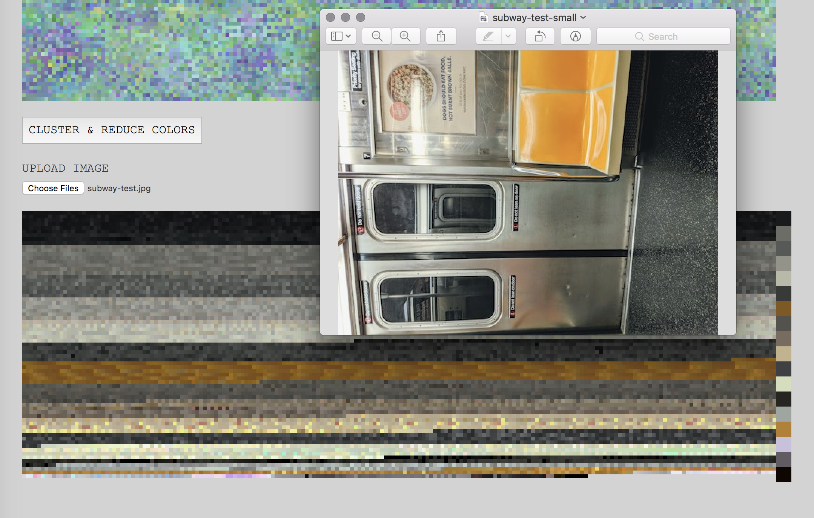

# camo-processing

_A prototype for generative camouflage patterns using perlin noise and colors pulled from an uploaded image_

This project extends the perlin noise visualizations in [p5js-camo](https://github.com/lizzthabet/p5js-camo) to create a fractal pattern that can be colored with _k_ mean colors from an uploaded image. It draws on the methods and visuals explored in _[Urban camouflage assessment through visual search and computational saliency](https://www.academia.edu/21209710/Urban_camouflage_assessment_through_visual_search_and_computational_saliency)_. Built with p5js and Typescript. 

_More details to come._
