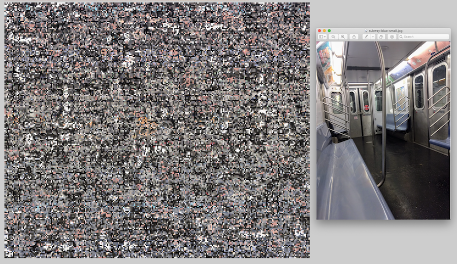

# Speculative camouflage generator

_A pattern generator to create wearable textile designs_

This tool can be used to create large patterns for wearables based on photographs of specific environments. It generates several designs that use multiscale and shape-disruptive camouflage techniques loosely based on a [scientific paper published in 2013](https://www.academia.edu/21209710/Urban_camouflage_assessment_through_visual_search_and_computational_saliency). Multiscale patterns employ details at various spatial scales to disguise the wearer, while disruptive patterns aim to distort and interrupt the wearer’s outline using blocks of shapes.

This tool’s patterns are rooted in the “real,” “historical,” and “scientific” but dismiss efficacy to speculate about how (and if?) camouflage can be used as a personal tool for bodied agency. It’s a part of a magical, material, and metaphorical costume that I’m building for myself, as a queer, femme body that lives and moves within a large city. I imagine camouflage as a conceptual and literal technology to hide, obscure, and misrecognize my body in public and corporate space.

## The codebase

This project is primarily build with Typescript, HTML, and CSS with minimal external dependencies. All pattern generation is done on the client-side, meaning that no backend server is needed to process data or run the application. 

It uses Webpack and Babel to compile and bundle source files and Gulp to manage development tasks and production builds. It uses Nginx to serve up the static website files and Tor to create and host over an onion site, (which can be accessed anonymously over the Tor network). Docker is used to create containerized versions of the Nginx server and Tor.

### How it works!
A color palette is generated from an uploaded image and applied to multiple patterns, depending on the parameters in the create pattern form submission.

**Color palette generation**
  -  Takes a list of RGB or HSL colors and converts them to LAB colors for more perceptually-accurate color grouping
  -  Uses the deltaE2000 color difference formula to calculate the similarity between two LAB colors
  -  Uses a k-means clustering algorithm to group color data into the most similar _k_ groups

**Fractal noise pattern**
  -  Generates a noise source pattern in HSL using Perlin noise with `p5js` and extracts a color palette from it
  -  Maps the color palette from the source image to the noise source pattern by frequency
  -  Generates the final noise pattern by substituting each color from the noise source with a color from the uploaded image's palette

**Shape disruptive pattern**
  -  Generates a number of random voronoi cells using `voronoi` library
  -  Randomly pairs colors from the source image's color palette to fill each voronoi cell with a gradient

**Forms**
  -  Builds HTML edit forms for each pattern and attaches the appropriate listeners

### Running the code

If you want to run the project locally, clone the repository and run a `yarn install`. I'd love to see others run, modify, and fork this tool. Feel free to reach out to me or open an issue in this repository if you run into any issues.
-  `yarn dev`: Runs the project with a development server
-  `yarn build`: Builds the project
-  `yarn serve` and `yarn publish`: Builds the project and hosts on an onion site

## Related repos

For experiments with perlin noise that led to the development of this noise pattern, check out [p5js-camo](https://github.com/lizzthabet/p5js-camo).